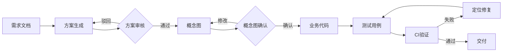
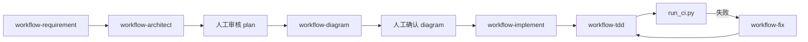

# 闭环开发系统 — 使用文档

本文档是 `system_design/` 模块的**唯一使用说明**，涵盖系统概述、目录结构、生成内容清单、完整操作流程、Cursor 集成与 FAQ。

> **模块位置**：`harness/system_design/`（自包含的闭环开发流水线，与业务仓库其他目录解耦）

---

## 1. 系统概述

闭环开发系统是一套 **「需求 → 方案 → 审核 → 概念图 → 确认 → 代码 → 测试 → CI → 交付」** 的可审计开发流水线。

### 1.1 核心原则

| 原则 | 说明 |
|------|------|
| 阶段门禁 | 每阶段产出固定格式，未确认不得进入下一阶段 |
| 产物可追溯 | 需求 ID → 方案版本 → 概念图 → 代码 → 测试报告，全链路关联 |
| 人类在环 | AI 负责起草与执行，人类负责方案、架构、上线等关键决策 |
| 验证驱动 | 测试与 CI 是闭环的「事实来源」，失败则回到上游修正 |

### 1.2 状态机

```
DRAFT_PLAN → PLAN_REVIEW → DIAGRAM_DRAFT → DIAGRAM_APPROVED
→ CODE_GEN → TEST_GEN → CI_RUNNING → PASSED | FAILED
```

失败时可通过 `classify-failure` + `rollback` 回退到对应阶段。



### 1.3 模块组成一览

| 层级 | 路径 | 作用 |
|------|------|------|
| 文档 | `WORKFLOW.md` | 本文档 |
| 模板 | `templates/` | 各阶段产物模板 |
| 产物 | `requirements/` `plans/` `diagrams/` `reviews/` `.workflows/` | 流程产出物 |
| 编排 | `scripts/workflow/` | 状态机 CLI、本地 CI |
| 能力 | `.cursor/skills/` | 分阶段 Agent Skills |
| 门禁 | `checklists/` + `.cursor/rules/` + `.cursor/hooks/` | 人工审核 + 自动约束 |
| 验证 | `run_ci.py` + `.github/workflows/ci.yml` | lint + test |
| 试点 | `REQ-001` | 端到端参考示例 |

---

## 2. 快速入门

> **所有 CLI 命令均需在 `system_design/` 目录下执行。**

### 2.1 环境准备

```bash
cd harness/system_design
pip install -r requirements-dev.txt
```

依赖：`pytest`（测试）、`ruff`（lint）。

验证环境：

```bash
python -m pytest tests -v
python -m unittest discover -s scripts/workflow/tests -v
python -m ruff check src tests scripts/workflow
```

### 2.2 Cursor 工作区配置

Skills、Rules、Hooks 位于 `system_design/.cursor/`，有两种使用方式：

| 方式 | 说明 | 适用场景 |
|------|------|----------|
| **推荐** | 在 Cursor 中将 `system_design/` 作为工作区根目录打开 | Rules/Skills/Hooks 自动生效 |
| **备选** | 工作区为 `harness/` 时，对话中手动 `@` 引用 | 多模块并存、临时使用 |

备选方式常用引用：

- `@system_design/WORKFLOW.md` — 本文档
- `@system_design/requirements/REQ-001.md` — 需求格式参考
- `@system_design/.cursor/skills/closed-loop-workflow/SKILL.md` — 流程总览

不确定下一步时，可直接说：**「按 `closed-loop-workflow` skill 继续 REQ-xxx」**。

### 2.3 五分钟上手（新需求 REQ-002）

```bash
# 1. 初始化
python scripts/workflow/workflow.py init REQ-002 --url "https://..." --title "功能名"

# 2. 查看进度
python scripts/workflow/workflow.py status REQ-002 --human
python scripts/workflow/workflow.py next REQ-002
```

随后在 Cursor 中按阶段引用 Skill，并用 CLI 完成人工审核：

```bash
# 方案审核通过
python scripts/workflow/workflow.py approve REQ-002 --gate plan --by 你的名字

# 概念图确认通过
python scripts/workflow/workflow.py approve REQ-002 --gate diagram --by 你的名字

# 写代码前验证门禁
python scripts/workflow/workflow.py validate REQ-002 --action implement

# CI 验证 + 交付
python scripts/workflow/run_ci.py REQ-002
python scripts/workflow/workflow.py approve REQ-002 --gate code --by 你的名字
```

阶段与 Skill 对应关系：

| 阶段 | Cursor Skill | 人工 Checklist |
|------|--------------|----------------|
| DRAFT_PLAN | `workflow-requirement` → `workflow-architect` | — |
| PLAN_REVIEW | — | [checklists/plan-review.md](checklists/plan-review.md) |
| DIAGRAM_DRAFT | `workflow-diagram` | [checklists/diagram-review.md](checklists/diagram-review.md) |
| DIAGRAM_APPROVED+ | `workflow-implement` | — |
| TEST_GEN | `workflow-tdd` | [checklists/code-delivery.md](checklists/code-delivery.md) |
| FAILED | `workflow-fix` | — |



---

## 3. 目录结构

```text
harness/system_design/
├── WORKFLOW.md                 # 本文档
├── pyproject.toml
├── requirements-dev.txt
│
├── templates/                  # 各阶段产物模板
├── requirements/               # 结构化需求（REQ-001 试点）
├── plans/                      # 实现方案
├── diagrams/                   # Mermaid 概念图
├── reviews/                    # 审核记录、测试覆盖矩阵
├── .workflows/                 # 状态机运行时（state.json、ci-last.log）
├── checklists/                 # 人工审核清单
├── src/                        # 业务代码
├── tests/                      # 测试代码
├── scripts/workflow/           # 编排 CLI
│   ├── workflow.py
│   ├── run_ci.py
│   └── check_pr_gates.py
├── .cursor/
│   ├── rules/closed-loop-workflow.mdc
│   ├── hooks.json
│   ├── hooks/workflow-context.py
│   └── skills/                 # 7 个分阶段 Skill
└── .github/workflows/ci.yml
```

---

## 4. 生成内容清单

### 4.1 模板层（`templates/`）

| 文件 | 产出路径 |
|------|----------|
| `requirement.md` | `requirements/{req_id}.md` |
| `plan.md` | `plans/{req_id}-plan-vN.md` |
| `diagram-readme.md` | `diagrams/{req_id}/README.md` |
| `review.md` | `reviews/{req_id}-*-review.md` |
| `state.json` | `.workflows/{req_id}/state.json` |
| `test-coverage-matrix.md` | `reviews/{req_id}-coverage-matrix.md` |

### 4.2 编排层（`scripts/workflow/`）

| 组件 | 说明 |
|------|------|
| `workflow.py` | 状态机 CLI：init / status / approve / reject / validate / rollback / classify-failure |
| `run_ci.py` | 本地 CI：ruff lint + pytest，更新 state |
| `check_pr_gates.py` | PR 阶段检查 REQ 产物是否齐全 |

### 4.3 能力层（`.cursor/skills/`）

| Skill | 职责 |
|-------|------|
| `closed-loop-workflow` | 流程总览与快速开始 |
| `workflow-requirement` | 解析需求 → 结构化 requirements |
| `workflow-architect` | 生成/修订实现方案 |
| `workflow-diagram` | 生成 Mermaid 概念图 |
| `workflow-implement` | 按方案分批实现业务代码 |
| `workflow-tdd` | 按 AC 生成测试与覆盖矩阵 |
| `workflow-fix` | 分析 CI 失败并最小修复 |

### 4.4 门禁与验证层

| 组件 | 说明 |
|------|------|
| `checklists/plan-review.md` | 方案审核 Checklist |
| `checklists/diagram-review.md` | 概念图确认 Checklist |
| `checklists/code-delivery.md` | 代码交付 Checklist |
| `.cursor/rules/closed-loop-workflow.mdc` | 全局 Agent 规则 |
| `.cursor/hooks.json` | 会话/编辑时注入 workflow 上下文 |
| `.github/workflows/ci.yml` | 远程 CI |

### 4.5 试点 REQ-001

| 产物 | 说明 |
|------|------|
| `requirements/REQ-001.md` | 需求：工作流状态人性化输出 |
| `plans/REQ-001-plan-v1.md` | 已批准方案 |
| `diagrams/REQ-001/` | 架构图 + 时序图 |
| `src/workflow/status_formatter.py` | 实现代码 |
| `tests/test_status_formatter.py` | AC-1 ~ AC-3 测试 |
| `.workflows/REQ-001/state.json` | 状态：PASSED |

---

## 5. 完整操作流程

以下以 `REQ-002` 为例，展开 [§2.3 快速入门](#23-五分钟上手新需求-req-002) 的各步骤细节。

### 5.1 初始化

```bash
python scripts/workflow/workflow.py init REQ-002 \
  --url "https://your-wiki/page" \
  --title "功能名称"
```

自动创建：`.workflows/REQ-002/state.json`、`requirements/REQ-002.md`、`plans/REQ-002-plan-v1.md`、`diagrams/REQ-002/`、`reviews/REQ-002-plan-review.md`。

### 5.2 需求解析

引用 Skill **`workflow-requirement`**，提供需求链接或正文。Agent 填充 `requirements/REQ-002.md`：

- 用户故事
- 验收标准（AC-1, AC-2…，Given-When-Then）
- 范围（做 / 不做）

### 5.3 生成方案

引用 Skill **`workflow-architect`**，填充 `plans/REQ-002-plan-v1.md`：

```bash
python scripts/workflow/workflow.py advance REQ-002 --to PLAN_REVIEW
```

### 5.4 方案审核（人工关卡）

对照 [checklists/plan-review.md](checklists/plan-review.md)。

```bash
# 通过
python scripts/workflow/workflow.py approve REQ-002 --gate plan --by your-name

# 驳回（重新生成 plan-v2）
python scripts/workflow/workflow.py reject REQ-002 --gate plan --by your-name \
  --reason "验收标准缺少异常场景"
```

### 5.5 生成概念图

引用 Skill **`workflow-diagram`**，产出 `diagrams/REQ-002/` 下 Mermaid 图及 README。

### 5.6 概念图确认（人工关卡）

对照 [checklists/diagram-review.md](checklists/diagram-review.md)。

```bash
python scripts/workflow/workflow.py approve REQ-002 --gate diagram --by your-name
```

### 5.7 实现业务代码

**写代码前必须验证门禁：**

```bash
python scripts/workflow/workflow.py validate REQ-002 --action implement
```

返回 `"valid": true` 后，引用 Skill **`workflow-implement`**，按方案文件清单分批实现。建议分支：`feat/REQ-002-*`。

### 5.8 生成测试

```bash
python scripts/workflow/workflow.py advance REQ-002 --to TEST_GEN
```

引用 Skill **`workflow-tdd`**，填写 `reviews/REQ-002-coverage-matrix.md`。

### 5.9 CI 验证

```bash
python scripts/workflow/run_ci.py REQ-002
```

- 通过 → stage 变为 `CI_RUNNING`
- 失败 → stage 变为 `FAILED`，进入 §5.10

### 5.10 CI 失败处理（闭环回流）

```bash
python scripts/workflow/workflow.py classify-failure REQ-002
python scripts/workflow/workflow.py rollback REQ-002 --to CODE_GEN --reason "业务逻辑错误"
# 引用 workflow-fix 修复后重新跑 CI
python scripts/workflow/run_ci.py REQ-002
```

| 失败类型 | 回退阶段 |
|----------|----------|
| 测试断言/用例错误 | TEST_GEN |
| lint / 类型 / 逻辑错误 | CODE_GEN |
| 方案遗漏 | PLAN_REVIEW |
| 架构/模块划分错误 | DIAGRAM_DRAFT |

同一 REQ 连续失败超过 3 次（`max_failures_before_escalate`）将 escalate，需人工介入。

### 5.11 交付确认

```bash
python scripts/workflow/workflow.py approve REQ-002 --gate code --by your-name
```

stage → `PASSED`，可创建 PR。对照 [checklists/code-delivery.md](checklists/code-delivery.md)。

---

## 6. CLI 命令速查

| 命令 | 说明 |
|------|------|
| `workflow.py init REQ-xxx [--url] [--title]` | 初始化新需求 |
| `workflow.py list` | 列出所有工作流 |
| `workflow.py status REQ-xxx` | JSON 状态 |
| `workflow.py status REQ-xxx --human` | 人性化摘要 |
| `workflow.py next REQ-xxx` | 推荐下一步 |
| `workflow.py advance REQ-xxx --to STAGE` | 手动推进阶段 |
| `workflow.py approve REQ-xxx --gate plan\|diagram\|code --by NAME` | 审核通过 |
| `workflow.py reject REQ-xxx --gate plan\|diagram --reason "..."` | 审核驳回 |
| `workflow.py validate REQ-xxx --action implement\|test\|diagram` | 验证动作是否允许 |
| `workflow.py rollback REQ-xxx --to STAGE --reason "..."` | 回退到指定阶段 |
| `workflow.py classify-failure REQ-xxx [--log PATH]` | 分类 CI 失败 |
| `run_ci.py REQ-xxx` | 运行本地 CI |

---

## 7. 在 Cursor 中使用

### 7.1 Skill 选用

| 场景 | 操作 |
|------|------|
| 不确定从哪开始 | 引用 `closed-loop-workflow` |
| 解析需求 | 引用 `workflow-requirement` |
| 写方案 | 引用 `workflow-architect` |
| 画概念图 | 引用 `workflow-diagram` |
| 写代码 | 引用 `workflow-implement`（需先 validate） |
| 写测试 | 引用 `workflow-tdd` |
| CI 失败 | 引用 `workflow-fix` |

### 7.2 自动约束

- **Rules**（`closed-loop-workflow.mdc`）：工作区根为 `system_design/` 时自动生效，禁止跳过阶段门禁
- **Hooks**（`workflow-context.py`）：会话开始 / 文件编辑后注入活跃 workflow 上下文

### 7.3 查看试点示例

```bash
python scripts/workflow/workflow.py status REQ-001 --human
```

推荐阅读顺序：

1. [requirements/REQ-001.md](requirements/REQ-001.md)
2. [plans/REQ-001-plan-v1.md](plans/REQ-001-plan-v1.md)
3. [diagrams/REQ-001/README.md](diagrams/REQ-001/README.md)
4. [src/workflow/status_formatter.py](src/workflow/status_formatter.py)
5. [tests/test_status_formatter.py](tests/test_status_formatter.py)
6. [reviews/REQ-001-coverage-matrix.md](reviews/REQ-001-coverage-matrix.md)

---

## 8. 产物格式

### 8.1 state.json 关键字段

```json
{
  "req_id": "REQ-001",
  "stage": "PLAN_REVIEW",
  "plan_version": 1,
  "diagram_version": 1,
  "approvals": {
    "plan": { "by": "user", "at": "2026-06-14T00:00:00Z" }
  },
  "failure_count": 0,
  "history": []
}
```

| 字段 | 说明 |
|------|------|
| `stage` | 当前阶段 |
| `plan_version` | 方案版本号，驳回后递增 |
| `approvals` | 已通过的审核关卡（plan / diagram / code） |
| `failure_count` | CI 连续失败次数 |
| `history` | 全量审计日志 |

### 8.2 验收标准格式

```yaml
acceptance_criteria:
  - id: AC-1
    given: "前置条件"
    when: "操作"
    then: "预期结果"
```

每个 AC 在测试中须有 1:1 映射（测试名含 `AC1` 等标识）。

---

## 9. CI 配置

### 9.1 本地 CI（`run_ci.py`）

1. `ruff check src tests`（未安装则跳过）
2. `pytest tests -v`
3. 写入 `.workflows/{req_id}/ci-last.log`
4. 更新 state（通过 → `CI_RUNNING`；失败 → `FAILED`）

### 9.2 GitHub Actions

推送或 PR 到 `main`/`master`/`feat/**` 时触发 [.github/workflows/ci.yml](.github/workflows/ci.yml)：

- ruff lint
- pytest
- orchestrator 自测

---

## 10. 扩展路线

当前实现对应 **Phase 1 + Phase 2（轻量版）**：

| 已完成 | 待扩展（Phase 3） |
|--------|-------------------|
| 模板 + Skills + Rules | 需求链接自动抓取（Confluence/飞书 API） |
| CLI 状态机 | Web 审核台 |
| 本地 + GitHub CI | 多 REQ 并行调度 |
| Cursor Hooks | Temporal / LangGraph 编排服务 |

---

## 11. 常见问题

**Q：Skills / Rules 没有自动生效？**

确认 Cursor 工作区根目录是否为 `system_design/`。若工作区为 `harness/`，请用 `@system_design/...` 手动引用，或将 `system_design/.cursor/`  symlink 到工作区根。

**Q：Agent 直接写代码被阻止？**

```bash
python scripts/workflow/workflow.py validate REQ-xxx --action implement
```

确认 plan 和 diagram 均已 approve。

**Q：`approve --gate code` 报错 stage 不对？**

需先运行 `run_ci.py`，CI 通过后 stage 为 `CI_RUNNING`，再 approve。

**Q：如何新增需求但不污染 REQ-001？**

```bash
python scripts/workflow/workflow.py init REQ-003 --title "新功能"
```

**Q：中文输出乱码（Windows 终端）？**

功能不受影响。可设置 `$env:PYTHONIOENCODING="utf-8"` 或将输出重定向到文件。

---

## 12. 文件索引

| 类型 | 路径 |
|------|------|
| 使用文档 | `system_design/WORKFLOW.md`（本文档） |
| 项目规范 | `harness/todo/AGENTS.md` |
| 总览 Skill | `.cursor/skills/closed-loop-workflow/SKILL.md` |
| 全局规则 | `.cursor/rules/closed-loop-workflow.mdc` |
| 编排 CLI | `scripts/workflow/workflow.py` |
| 审核清单 | `checklists/` |
| 试点需求 | `REQ-001` 全套产物 |
