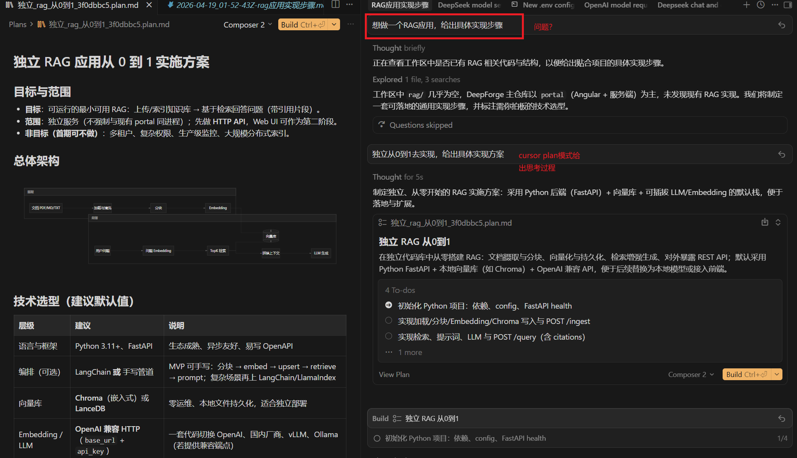
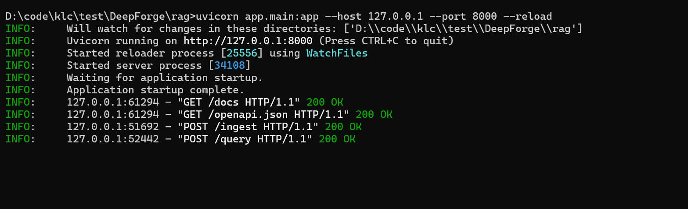
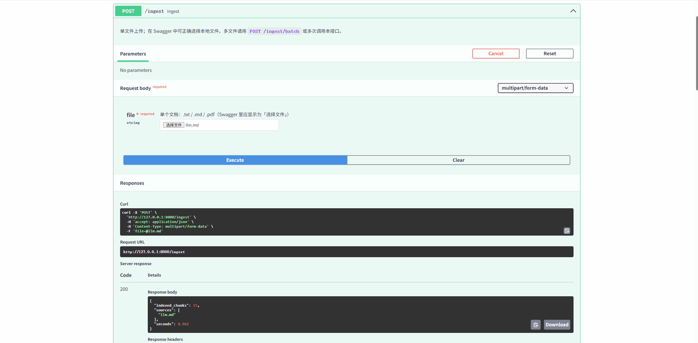
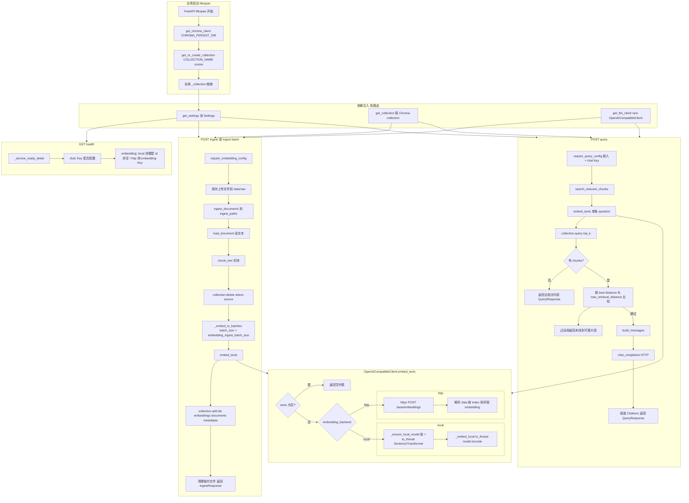

# 使用cursor生成RAG项目并跑通流程

## 提出问题

## cursor给出具体方案

总体实现：

**目标**：可运行的最小可用 RAG：上传/索引知识库 → 基于检索回答问题（带引用片段）。

详细见  `独立_rag_从0到1_.md`

## 根据运行手册执行程序

详细参考 `运行手册.md`

中间遇到很多问题，具体见 `调试过程.md`

## 最终可执行程序

### 1. 安装并验证embeding模型可用

具体见 `安装并验证embeding模型可用.md`

### 2. 运行rag应用程序

### 3. 进行问答

## 整个代码流程图

