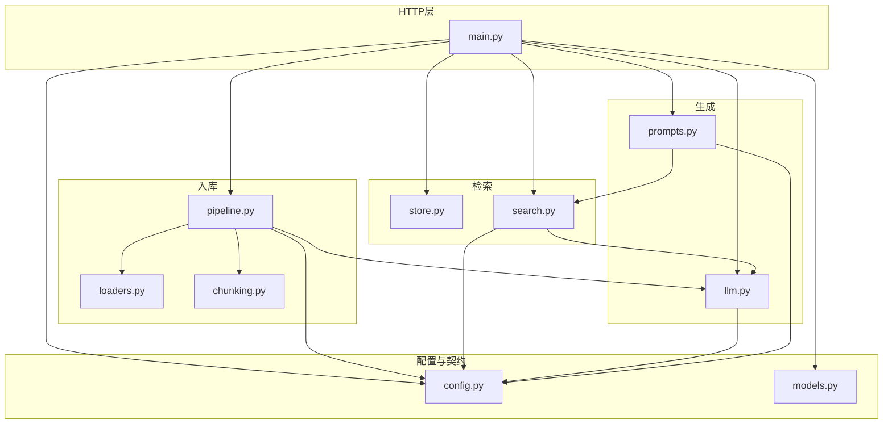

下面按 **文件逐项说明** + **模块如何串起来**，范围是 `rag/app/` 下的应用代码。

---

## 一、分层总览

| 层级 | 文件 | 职责 |
|------|------|------|
| **入口 / HTTP** | `main.py` | FastAPI 应用、生命周期、路由、依赖注入 |
| **配置** | `config.py` | 环境变量、默认值、推导出的 URL / Key |
| **契约（API Schema）** | `models.py` | 请求/响应 Pydantic 模型 ↔ OpenAPI `/docs` |
| **向量库** | `retrieval/store.py` | Chroma 持久化客户端与 collection |
| **检索** | `retrieval/search.py` | 问句向量 → collection.query → `RetrievedChunk` |
| **LLM / 嵌入** | `generation/llm.py` | HTTP 或与 OpenAI 兼容的 embedding/chat；可选本地 `sentence_transformers` |
| **Prompt** | `generation/prompts.py` | 检索结果拼上下文、编号、系统提示 |
| **解析** | `ingestion/loaders.py` | txt/md/pdf → 纯文本 |
| **分块** | `ingestion/chunking.py` | 定长重叠切分 → `TextChunk` |
| **入库编排** | `ingestion/pipeline.py` | 加载→分块→删旧同源→embedding→写入 Chroma |
| **包标记** | `__init__.py`（各处） | 包说明或精简 re-export |

`app/__init__.py` 仅占位；`generation/__init__.py`、`retrieval/__init__.py`、`ingestion/__init__.py` 主要是导出/说明，核心业务仍被 `main.py` 从子模块直接 import。

---

## 二、各文件详解

### 1. [`main.py`](d:/code/klc/test/DeepForge/rag/app/main.py)

- **`lifespan`**：启动时 `get_chroma_client` + `get_or_create_collection`，把 `_collection` 灌进全局依赖；关停时清空。
- **配置门禁**：`_embedding_configured` / `_chat_api_configured`、`require_*`：`/ingest` 只要 embedding，`/query` 还要 chat。
- **依赖**：`get_settings` → 单例 `settings`；`get_collection` → 上面的 Chroma collection；`get_llm_client` → `OpenAICompatibleClient(settings)`。
- **路由**：
  - `/health`：用 `HealthResponse`，不强制执行 API Key，只做 ready 诊断。
  - `/ingest`、`/ingest/batch`：文件落盘后调 `ingest_documents`，再在 `finally` 里删掉临时文件。
  - `/query`：`search_relevant_chunks` → 距离阈值 → `build_messages` → `chat_completion` → `Citation` 列表。

这是 **唯一能直接看到「HTTP ↔ 领域逻辑」胶水** 的文件。

---

### 2. [`config.py`](d:/code/klc/test/DeepForge/rag/app/config.py)

- **`Settings`**：从 `.env` 读变量；embedding/chat 可分 URL 与 Key，空的则回落到 `OPENAI_*`。
- **`normalize_openai_v1_base`**（本文件）：保证 base URL 以 `/v1` 结尾（给 `llm.py` 拼 `/embeddings`、`/chat/completions`）。
- **`embedding_backend`**：`http` 走远程 API；`local` 时用 `resolved_local_embedding_model_id`、`local_embedding_batch_size` 等。
- **RAG 相关**：`chunk_size` / `chunk_overlap`、`top_k`、`max_context_chars`、`max_retrieval_distance`、`chroma_persist_dir`、`collection_name`。
- **`settings`**：模块级单例，全应用共享。

几乎所有业务模块构造函数或函数参数里都出现 `Settings`。

---

### 3. [`models.py`](d:/code/klc/test/DeepForge/rag/app/models.py)

纯 **DTO**：与路由的 `response_model`、`QueryRequest` 体绑定。  
和 `generation/prompts` 里的 **`RetrievedChunk`（dataclass）** 不同：`Citation` 是 API  outward 裁剪版（例如在 `main` 里 `text[:2000]`）。

---

### 4. [`ingestion/loaders.py`](d:/code/klc/test/DeepForge/rag/app/ingestion/loaders.py)

- 按后缀分流：文本 UTF-8 读入；PDF 用 `pypdf` 抽正文。
- `safe_source_name`：入库时用作 `metadata["source"]`，与 `pipeline` 里覆盖「同文件名旧 chunk」的逻辑一致。

---

### 5. [`ingestion/chunking.py`](d:/code/klc/test/DeepForge/rag/app/ingestion/chunking.py)

- 滑动窗口：`chunk_size` + `chunk_overlap`，产出 `TextChunk(text, chunk_index, source)`。
- 参数校验（overlap 必须在 `[0, chunk_size)`）避免死循环或无意义配置。

---

### 6. [`ingestion/pipeline.py`](d:/code/klc/test/DeepForge/rag/app/ingestion/pipeline.py)

对每个文件：

1. `load_document` → `chunk_text`（用上 `settings.chunk_*`）。
2. `collection.delete(where={"source": source})`：同名文件视为全量替换。
3. `_embed_in_batches` 调 `OpenAICompatibleClient.embed_texts`（batch 大小：`settings.embedding_ingest_batch_size`）。
4. `collection.add`：ids、向量、documents、metadata（`source`、`chunk_index`）。

`ingest_documents` 只是 `ingest_paths` 的薄封装，供 `main` 调用。

---

### 7. [`retrieval/store.py`](d:/code/klc/test/DeepForge/rag/app/retrieval/store.py)

- **PersistentClient**：数据在 `CHROMA_PERSIST_DIR`。
- **collection metadata `hnsw:space": "cosine"`**：与 `search` 里解释的 **distance** 语义一致（Chroma cosine 空间的距离）。

仅被 `main` 在 lifespan 中使用。

---

### 8. [`retrieval/search.py`](d:/code/klc/test/DeepForge/rag/app/retrieval/search.py)

- 对用户问题 **`embed_texts([question])`**（与 ingestion 同源客户端，向量空间一致）。
- `collection.query`：`n_results=top_k`，拉回 documents / metadatas / distances。
- 组装 **`RetrievedChunk`**，供 **`prompts.build_messages`** 和 **`main` 里Citation** 使用。

依赖：`Settings`、`OpenAICompatibleClient`。**不依赖** `models.py`（领域中间结构用 dataclass）。

---

### 9. [`generation/llm.py`](d:/code/klc/test/DeepForge/rag/app/generation/llm.py)

- **构造**：固化 `normalize_openai_v1_base(resolved_embedding_base_url / chat_base_url)`。
- **`embed_texts`**：`local` 分支懒加载 `SentenceTransformer`，`encode` 在线程池；否则 POST OpenAI 式 `embeddings`。
- **`chat_completion`**：POST `chat/completions`，取出 `choices[0].message.content`。

被 **ingestion（批量向量）** 和 **retrieval.search（查询向量）** 和 **main.query（最终回答）** 三条路径共用。

---

### 10. [`generation/prompts.py`](d:/code/klc/test/DeepForge/rag/app/generation/prompts.py)

- **`build_context_block`**：按 `max_context_chars` 截断，给每个 chunk 编号 `[1]`、`[2]`…，并维护 `(id, RetrievedChunk)` 映射供引用。
- **`build_messages`**：系统提示要求只根据上下文作答并带 `[n]` 引用；用户消息里拼 「Context + Question」。

只依赖 **`Settings`** 与 **`RetrievedChunk`**。

---

## 三、模块依赖关系（谁 import 谁）

`models.py` **不被** ingestion / retrieval / generation 引用，只服务于 HTTP 契约；**`RetrievedChunk`** 在 `search` ↔ `prompts` ↔ `main` 之间传递检索结果。

---

## 四、两条主业务流程（把所有文件连成线）

**写入（Ingest）**  
`main` 保存上传 → `ingest_documents` → `load_document` → `chunk_text` → `client.embed_texts` → `collection.add`（可先 `delete` 同 source）。

**问答（Query）**  
`main` 收 `QueryRequest` → `search_relevant_chunks`（`embed` + Chroma query）→ 可选距离过滤 → `build_messages` → `chat_completion` → 拼装 `Citation` + `QueryResponse`。

---

以上就是 `rag/app` 下每个代码文件的职责划分，以及它们如何通过 **`Settings`、`OpenAICompatibleClient`、`Chroma collection`、`RetrievedChunk` / `TextChunk`** 连在一起。若你希望针对某一条调用链（例如「仅本地 embedding」或「Citation 编号如何对齐 `[1]`」）再拆开讲，可以指定场景我单独展开。