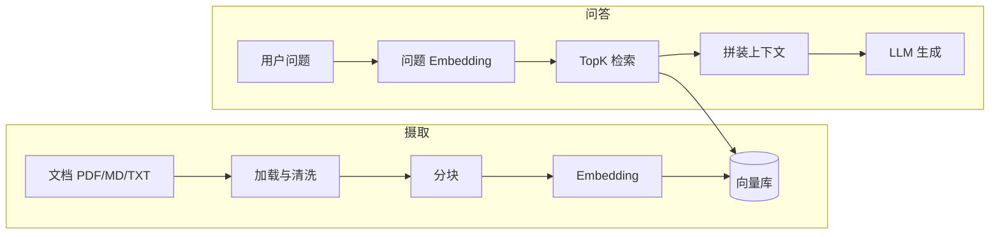

# 独立 RAG 应用从 0 到 1 实施方案

## 目标与范围

- **目标**：可运行的最小可用 RAG：上传/索引知识库 → 基于检索回答问题（带引用片段）。
- **范围**：独立服务（不强制与现有 portal 同进程）；先做 **HTTP API**，Web UI 可作为第二阶段。
- **非目标（首期可不做）**：多租户、复杂权限、生产级监控、大规模分布式索引。

## 总体架构




## 技术选型（建议默认值）


| 层级              | 建议                                         | 说明                                                                          |
| --------------- | ------------------------------------------ | --------------------------------------------------------------------------- |
| 语言与框架           | Python 3.11+、FastAPI                       | 生态成熟、异步友好、易写 OpenAPI                                                        |
| 编排（可选）          | LangChain **或** 手写管道                       | MVP 可手写：分块 → embed → upsert → retrieve → prompt；复杂场景再上 LangChain/LlamaIndex |
| 向量库             | **Chroma**（嵌入式）或 **LanceDB**               | 零运维、本地文件持久化，适合独立部署                                                          |
| Embedding / LLM | **OpenAI 兼容 HTTP**（`base_url` + `api_key`） | 一套代码切换 OpenAI、国内厂商、vLLM、Ollama（若提供兼容端点）                                     |
| 配置              | `pydantic-settings` + `.env`               | 密钥不进代码                                                                      |


若需 **完全离线**：将 Embedding 换为 `sentence-transformers`（本地）+ Ollama 对话；向量库仍可用 Chroma。

## 目录结构（示例）

```
rag/
  app/
    main.py              # FastAPI 入口
    config.py            # 环境变量与配置
    models.py            # Pydantic 请求/响应
    ingestion/
      loaders.py         # 按后缀读文件
      chunking.py        # 分块策略（固定长度 + overlap）
      pipeline.py        # load → chunk → embed → upsert
    retrieval/
      store.py           # 向量库封装（collection 管理）
      search.py          # query embedding + top_k
    generation/
      prompts.py         # system/user 模板与引用格式化
      llm.py             # OpenAI 兼容 chat completions
  data/
    raw/                 # 原始上传（可选）
    chroma/              # Chroma 持久化目录（gitignore）
  tests/
  requirements.txt 或 pyproject.toml
  Dockerfile（可选）
  .env.example
```

## 分阶段实现步骤

### 阶段 1：项目骨架与配置

1. 初始化虚拟环境与依赖：`fastapi`, `uvicorn`, `httpx`（调 LLM）, `pydantic-settings`, 向量库客户端（如 `chromadb`）。
2. 定义配置项：`OPENAI_API_KEY`, `OPENAI_BASE_URL`, `EMBEDDING_MODEL`, `CHAT_MODEL`, `CHROMA_PERSIST_DIR`, `CHUNK_SIZE`, `CHUNK_OVERLAP`, `TOP_K`。
3. 实现 `GET /health`：返回版本与配置是否就绪（不写密钥）。

### 阶段 2：索引管线（Ingestion）

1. **加载**：支持至少 `txt` / `md`；可选加 `pdf`（`pypdf` 或 `unstructured`）。
2. **分块**：按字符或 token 近似长度切分，带 **overlap**（如 512/128），保留 `source_path` 与 `chunk_id` 元数据。
3. **向量化**：对每块调用 Embedding API，写入向量库；`document` 元数据含 `text`、`source`、`chunk_index`。
4. **API**：`POST /ingest` 接收单文件或多文件（multipart）或目录路径（仅本地开发可用）；返回索引块数量与耗时。

**注意**：生产环境应对单文件大小与总批量做限制；重复摄取需策略（按 `source` 先删再插，或内容 hash 去重）。

### 阶段 3：检索与生成（RAG 核心）

1. **检索**：用户问题 → Embedding → `top_k` 相似块；可做 **MMR** 或简单余弦相似度（依向量库能力）。
2. **提示词**：System 说明「仅依据上下文作答」；User = 拼接检索片段（带 `[1][2]` 引用编号）+ 用户问题。
3. **生成**：调用 Chat Completions；流式可选 `StreamingResponse`（SSE）。
4. **API**：`POST /query`，请求体含 `question`，响应含 `answer` 与 `citations`（引用文本与来源）。

### 阶段 4：质量与体验（仍属 MVP+）

1. **引用真实性**：答案中要求模型引用 `[n]`，与 `citations` 列表对齐（可减少胡编）。
2. **空检索**：`top_k` 分数低于阈值时返回「知识库中未找到」而非强行生成。
3. **简单评估**：固定若干问答对，脚本对比「有检索 vs 无检索」。

### 阶段 5：交付形态

1. **本地运行**：`uvicorn app.main:app --reload`；文档用 FastAPI 自带 `/docs`。
2. **容器（可选）**：Dockerfile 安装依赖，挂载 `data/chroma` 卷持久化索引。
3. **与前端集成（后续）**：任意前端调用 `POST /query`；portal 仅作为 HTTP 客户端即可。

## 关键接口契约（示例）

- `POST /ingest`：multipart 文件 → `{ "indexed_chunks": N, "sources": [...] }`
- `POST /query`：`{ "question": "..." }` → `{ "answer": "...", "citations": [ { "id": 1, "text": "...", "source": "..." } ] }`
- `GET /health`：`{ "status": "ok" }`

## 风险与对策

- **上下文超长**：对检索块总长度设上限，按相似度截断或只取前 N 块。
- **Embedding 与 Chat 模型不一致**：尽量同一厂商或至少同一语言空间；混用时需接受检索质量波动。
- **PDF 版式乱**：复杂 PDF 需更强解析（后期再换方案）。

## 建议实施顺序（最短路径）

1. 配置 + health + 空 `query` 调通 LLM（验证密钥与网络）。
2. 手写 chunk + Chroma upsert + 单文件 ingest。
3. 实现检索 + prompt + `/query` 端到端。
4. 再加流式、阈值、Docker、更多格式。

此方案与仓库内是否已有 `portal` 无关，可在任意新目录（例如 `rag/`）独立落地；确认后可按该顺序编码实现。